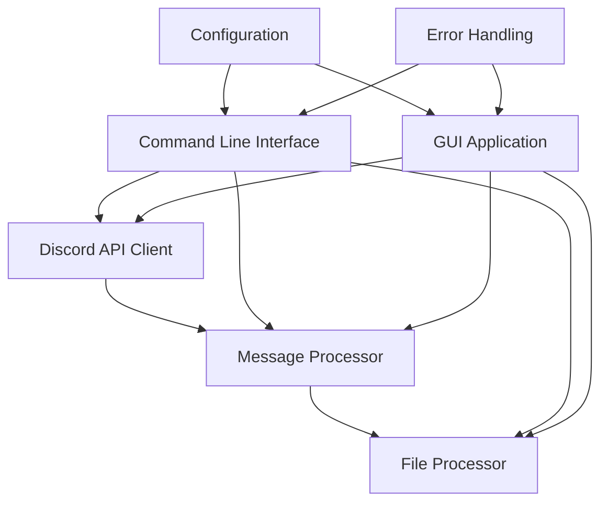
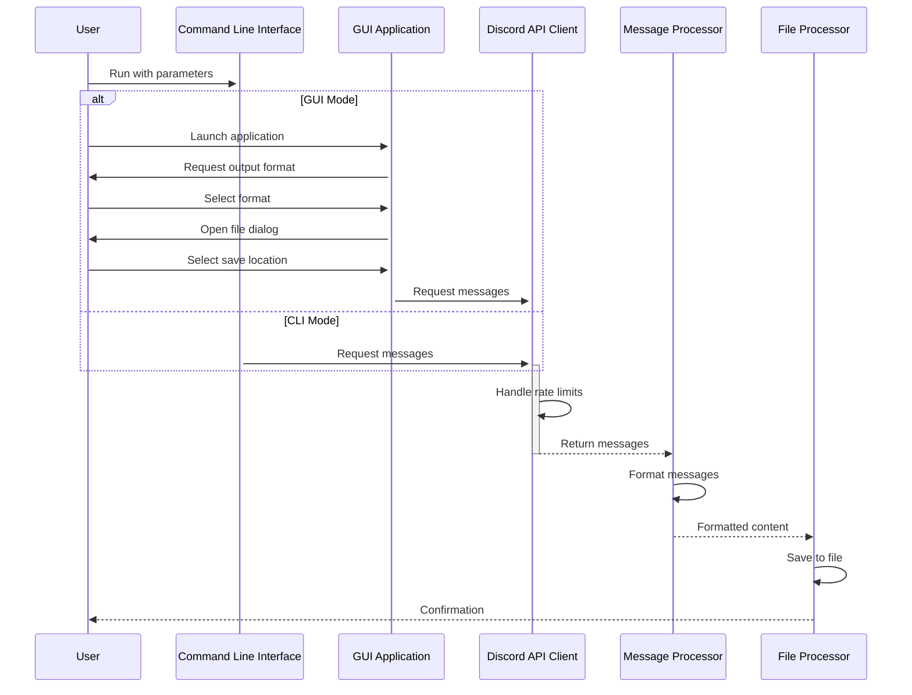

#  Discord Messages Dump

[](https://www.python.org/downloads/)
[](LICENSE)
[](https://github.com/psf/black)
[](https://github.com/bobbyiscool123/Discord_messages_dump)
[](https://bobbyiscool123.github.io/Discord_messages_dump/)

A professional tool to download and save message history from Discord channels. This package provides both a command line interface and a GUI application for flexibility, allowing users to fetch messages from Discord channels and save them in various formats including text, JSON, CSV, and Markdown. It handles pagination, rate limits, and provides detailed logging for troubleshooting.

📚 **[View Documentation](https://bobbyiscool123.github.io/Discord_messages_dump/)** - Comprehensive guides and API reference

## Architecture

The Discord Messages Dump package is built with a modular architecture that separates concerns and promotes maintainability:



## Features

* 📥 **Message Retrieval:** Fetches all messages from a given Discord channel with proper pagination
* 🔄 **Multiple Output Formats:** Saves messages in text, JSON, CSV, or Markdown formats
* ⌨️ **Command Line Interface:** Powerful CLI with options for token, channel ID, output format, and more
* 🔒 **Secure Credential Handling:** Uses a `.env` file and optional keyring integration for secure token storage
* 📂 **File Save Dialog:** Allows users to choose where to save the output file, including filename
* 📄 **Pagination Support:** Handles Discord API's pagination for retrieving large message histories
* ⏱️ **Rate Limit Handling:** Respects Discord's API rate limits with exponential backoff retry logic
* 📊 **Progress Bar:** Visual feedback on download progress with detailed logging
* 🔍 **Verbose Logging:** Colored console output and rotating file logs for troubleshooting
* 🛡️ **Error Handling:** Comprehensive error handling with fallback mechanisms

## How to Use

### Prerequisites

*   **Python 3.7+:** Ensure you have Python installed.
*   **Python Libraries:** Install the required libraries:
    ```bash
    pip install requests python-dotenv click tqdm
    ```
*   **Discord User Token:** You need your Discord user token. This is NOT a bot token. To obtain it:
    1.  Open Discord in your web browser or desktop app.
    2.  Press `Ctrl+Shift+I` (or `Cmd+Option+I` on macOS) to open the developer tools.
    3.  Go to the 'Network' tab.
    4.  Make any request on the Discord page, such as changing the current channel.
    5.  In the Network tab, find a request. It can be any request.
    6.  Scroll to the 'Headers' section of the request.
    7.  Find the `authorization` header. The value of that header is your user token.
        **Important:** Do not share your user token with anyone. Treat it like a password.
*   **Discord Channel ID:** You need the ID of the Discord channel you want to download messages from. To obtain the channel ID:
    1.  Enable developer mode in Discord settings (`User Settings` -> `Advanced` -> `Developer Mode` toggle).
    2.  Right-click the channel and select `Copy ID`.

### Setup

1.  **Clone the Repository:**
    ```bash
    git clone https://github.com/bobbyiscool123/Discord_messages_dump.git
    cd Discord_messages_dump
    ```

2.  **Create and Activate a Virtual Environment:**

    **Windows:**
    ```bash
    python -m venv venv
    venv\Scripts\activate
    pip install -r requirements.txt
    ```

    **Linux/macOS:**
    ```bash
    python3 -m venv venv
    source venv/bin/activate
    pip install -r requirements.txt
    ```

3.  **Set Up Environment Variables:**
    *   Copy the `.env.example` file to `.env`:
        ```bash
        cp .env.example .env
        ```
    *   Open the `.env` file in a text editor and add your Discord token and channel ID:
        ```env
        DISCORD_TOKEN="YOUR_DISCORD_TOKEN"
        DISCORD_CHANNEL_ID="YOUR_DISCORD_CHANNEL_ID"
        ```
        *Replace `YOUR_DISCORD_TOKEN` and `YOUR_DISCORD_CHANNEL_ID` with your actual values.*
    *   The `.env.example` file contains detailed instructions on how to obtain these values.

4.  **Install the Package in Development Mode (Optional):**
    ```bash
    pip install -e .
    ```
    This will install the package in development mode, allowing you to use the `discord-dump` command.

5. **Run the Script (Windows):**
   * Open a command prompt or PowerShell window.
   * Navigate to the repository directory using the `cd` command, example:
    ```bash
    cd path\to\discord_messages_dump
    ```
   *   Run the script:
    ```bash
    python Dump.py
    ```
    *   The script will open a file dialog prompting you to select where the output text file is saved.

6.  **Run the Script (Linux / macOS):**
    *   Open a terminal window.
    *   Navigate to the repository directory using the `cd` command, example:
      ```bash
      cd path/to/discord_messages_dump
      ```
    *   Run the script:
        ```bash
        python3 Dump.py
        ```
    *   The script will open a file dialog prompting you to select where the output text file is saved.

### Using the Command Line Interface

The package provides a powerful command line interface that can be used instead of the GUI application:

1. **Install the Package:**
   ```bash
   pip install -e .
   ```

2. **Basic Usage:**
   ```bash
   # Using command-line arguments
   discord-dump dump --token "YOUR_TOKEN" --channel-id "YOUR_CHANNEL_ID" --format text --output-file messages.txt

   # Using environment variables from .env file
   discord-dump dump --format json --output-file messages.json
   ```

3. **Available Options:**
   ```
   --token TEXT           Discord user token for authentication
   --channel-id TEXT      ID of the Discord channel to fetch messages from
   --format [text|json|csv|markdown]
                          Output format for the messages (default: text)
   --output-file TEXT     Path to save the messages to
   --limit INTEGER        Maximum number of messages to retrieve (default: 100)
   --no-gui               Disable GUI file dialog for selecting output file
   --verbose              Enable verbose logging
   --help                 Show help message and exit
   ```

4. **Install Command Completion:**
   ```bash
   discord-dump install-completion
   ```

## Quick Start

1. **Clone the repository**: `git clone https://github.com/bobbyiscool123/Discord_messages_dump.git`
2. **Install dependencies**: `pip install -r requirements.txt`
3. **Set up your Discord token**: Create a `.env` file with your `DISCORD_TOKEN` and `DISCORD_CHANNEL_ID`
4. **Run the CLI**: `python -m discord_messages_dump.cli dump --format json --output-file messages.json`
5. **Explore the output**: Open the saved file to view your Discord messages

## Workflow

The following diagram illustrates the typical workflow when using Discord Messages Dump:



## Supported Discord API Features

| Feature | Support | Notes |
|---------|---------|-------|
| Text Messages | ✅ | Full support for all text content |
| Attachments | ✅ | URLs and filenames included in output |
| Embeds | ✅ | Basic embed content supported |
| Reactions | ✅ | Emoji reactions included in JSON/CSV formats |
| Pins | ✅ | Pin status included in output |
| Edited Messages | ✅ | Edit timestamps included |
| Deleted Messages | ❌ | Cannot retrieve deleted messages |
| Voice Messages | ❌ | Voice chat not supported |

## Output Formats

The output file will contain the messages from the specified Discord channel, formatted according to the chosen format:
